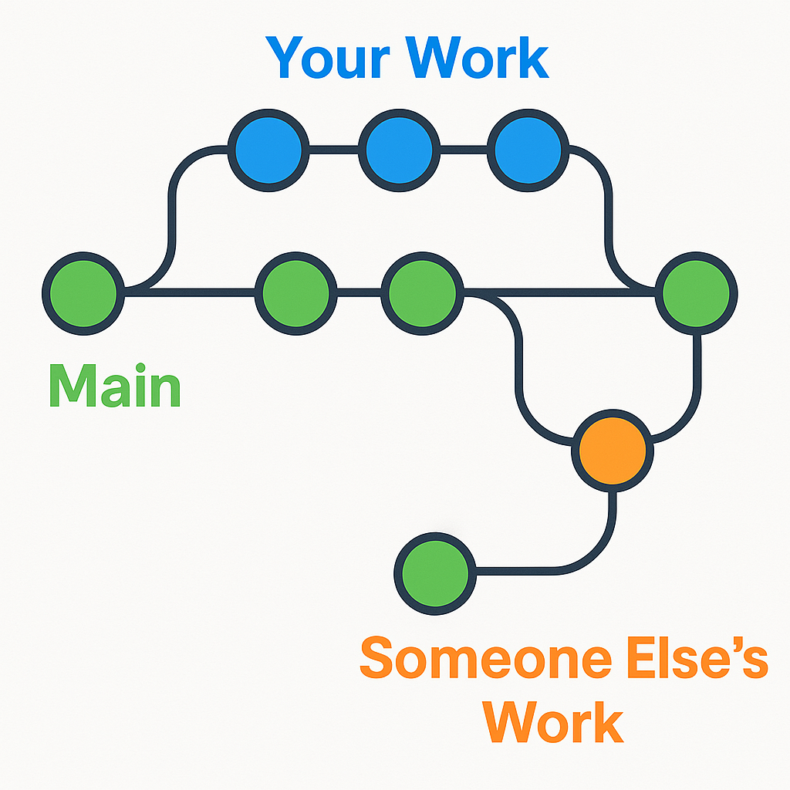
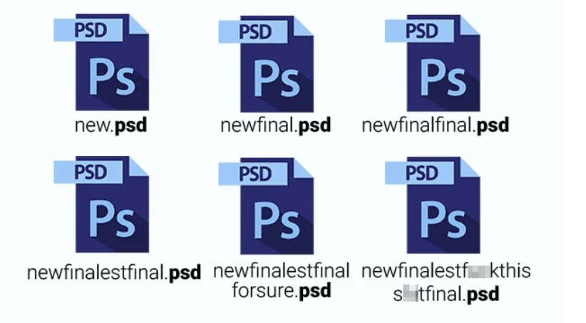

# Software Development Bootcamp

## Unit 2: JavaScript Foundations

### Lesson 1

### Gurneesh Singh

---

# Agenda

- Introduction to JavaScript Unit
- Git and Version Control Systems
- HTML/CSS and JavaScript Integration
- JavaScript Variables and Data Types
- Console.log() and window.alert()
- Operators and Expressions
- Next Lesson Preview

---

# Learning Objectives

By the end of this class, you will be able to:
* Create JavaScript variables
* Recognize basic functions (`window.alert()` and `console.log()`)
* Write JavaScript expressions
* Set up a Git local repository

---

# Section 1: Introduction

## Welcome to JavaScript Foundations!

- JavaScript is essential for making websites interactive
- This unit builds upon your HTML/CSS knowledge
- You will progressively add interactivity to your personal website
- By the end, you'll create dynamic web content

*This assignment is part of the 20% of your final grade for the Bootcamp*

---

# Section 2: Git and Version Control

## What is Version Control?

<div style="display: grid; grid-template-columns: 1fr 1fr; font-size: 20px;">



- A system that records changes to files over time
- Allows you to recall specific versions later
- Essential for collaboration in software development
- Keeps track of your project history

*Version control is a critical professional skill in software development*

---

# Why Version Control is Important

<div style="display: grid; grid-template-columns: 1fr 1fr;">



- Preserves development history
- Enables experimentation without fear
- Facilitates collaboration with others
- Provides backup and recovery
- Industry standard practice

*Every professional developer uses version control*

</div>

---

# Git: The Most Popular VCS

## What is Git?
- Distributed version control system
- Created by Linus Torvalds (creator of Linux)
- Free and open-source
- Fast and efficient
- Used by most software development teams worldwide

## Git vs. GitHub
- **Git**: The version control system
- **GitHub**: A web-based platform for Git repositories

---

# Setting up Git in VS Code

1. **Install Git**: Download and install from [git-scm.com](https://git-scm.com/)
2. **Verify Installation**: Open VS Code's integrated terminal and run:
   ```
   git --version
   ```
3. **Configure Git**: Set up your identity with:
   ```
   git config --global user.name "Your Name"
   git config --global user.email "your.email@example.com"
   ```

*VS Code has excellent built-in Git integration*

---

# Git Basics in VS Code

<div style="display: grid; grid-template-columns: 1fr 1fr; font-size: 20px;">

<div>


</div>

<div>


## Using Git in VS Code:

1. Initialize a repository: 
   - Click on Source Control icon in the sidebar
   - Click "Initialize Repository"

2. Stage changes:
   - After making changes, files appear in the Changes section
   - Click the + button to stage changes

3. Commit changes:
   - Add a commit message
   - Click the checkmark to commit

</div>

</div>


---

# Git Workflow Demo

Let's see Git in action with a simple text file:

1. Create a new folder and initialize a Git repository
2. Create a text file with some content
3. Stage the changes
4. Commit with a meaningful message
5. Make additional changes
6. View the difference and commit again
7. View the commit history

*A step-by-step guide is available in the LMS if needed*

---


# Section 3: HTML/CSS and JavaScript

## How They Work Together

- **HTML**: Structure and content (nouns)
- **CSS**: Presentation and style (adjectives)
- **JavaScript**: Behavior and interactivity (verbs)


*These three technologies form the foundation of modern web development*

---

# JavaScript in Web Development

## What JavaScript Does:
- Responds to user actions
- Updates content dynamically
- Communicates with servers
- Validates forms
- Creates animations and effects
- Builds complete applications

*JavaScript enables all the interactive elements you use on websites daily*

---

# JavaScript Integration Methods

## Three ways to add JavaScript to HTML:

<div style="font-size: 20px;">

1. **Inline JavaScript (written in the HTML file):**
```html
<button onclick="alert('Hello!')">Click me</button>
```

2. **Internal JavaScript (written in the HTML file):**
```html
<script>
    function greet() {
        alert('Hello, world!');
    }
</script>
```

3. **External JavaScript (script tag in HTML links to a separate .js file):**
```html
<script src="script.js"></script>
```

---

# Comparing JavaScript Integration Methods

| Method | Advantages | Disadvantages |
|--------|------------|---------------|
| **Inline** | Simple for small functions | Mixes HTML and JS, hard to maintain |
| **Internal** | All code in one file | Can make HTML files large and cluttered |
| **External** | Clean separation, reusability, caching | Requires additional HTTP request |

*External JavaScript is generally considered best practice for most situations*

---

# Example: JavaScript Integration

<div style="font-size: 20px;">

```html
<!DOCTYPE html>
<html lang="en">
<head>
    <meta charset="UTF-8">
    <title>JavaScript Demo</title>
    <!-- Internal JavaScript -->
    <script>
        function showMessage() {
            alert('Button was clicked!');
        }
    </script>
    <!-- External JavaScript -->
    <script src="script.js"></script>
</head>
<body>
    <!-- Inline JavaScript -->
    <button onclick="alert('Inline JS')">Inline</button>
    <button onclick="showMessage()">Call Function</button>
</body>
</html>
```

</div>

---

# 10-Minute Break

*We'll continue with JavaScript Variables after the break*

---

# Section 4: JavaScript Variables

## What is a Variable?
- A "container" for storing data values
- Like a labeled box that holds information
- Can be updated or changed throughout your program

```javascript
// Declaring a variable and assigning a value
let message = "Hello, world!";

// Using the variable
console.log(message);  // Outputs: Hello, world!

// Changing the value
message = "Welcome to JavaScript!";
console.log(message);  // Outputs: Welcome to JavaScript!
```

---

# Variable Declaration Methods

```javascript
// var - traditional way (pre-ES6)
var oldWay = "I'm declared with var";

// let - modern way for variables that change
let modernVariable = "I can be reassigned";
modernVariable = "See? I changed!";

// const - for constants that don't change
const fixedValue = "I cannot be reassigned";
// fixedValue = "This would cause an error";
```

*Best practice: Use `const` by default, and `let` when you need to reassign*

---

# JavaScript Data Types

<div style="font-size: 20px;">

## Primitive Data Types:

1. **Number** - Integers or floating-point numbers
   ```javascript
   const age = 30;
   const price = 19.99;
   ```

2. **String** - Text enclosed in quotes
   ```javascript
   // can be single or double quotes
   const name = "John";
   const greeting = 'Hello!';
   ```

3. **Boolean** - true or false
   ```javascript
   let isActive = true;
   let isComplete = false;
   ```

</div>

---

# More JavaScript Data Types

<div style="font-size: 20px;">

4. **Undefined** - Variable declared but not assigned a value
   ```javascript
   let undefinedVar;
   console.log(undefinedVar);  // Outputs: undefined
   ```

5. **Null** - Intentional absence of any value
   ```javascript
   let emptyValue = null;
   ```

6. **Symbol** and **BigInt** - Advanced types we'll cover later

*JavaScript is dynamically typed - variables can change types*

</div>


---

# Browser Console and Testing Code

## Browser Dev Tools
- Essential tool for JavaScript development
- Press F12 or right-click → Inspect → Console
- Use for testing, debugging, and exploring

## Basic commands:
```javascript
// Log a message
console.log("This appears in the console");

// Alert - creates a popup
window.alert("This creates a popup!");
```

---

# console.log() vs window.alert()

<div style="font-size: 20px;">

## console.log()
- Outputs to browser console (only visible in dev tools)
- Doesn't interrupt user experience
- Can log multiple data types and objects
- Used for debugging and development

## window.alert()
- Creates a popup dialog that user must dismiss
- Interrupts user experience
- Limited to string display
- Rarely used in production sites

*console.log() is your best friend during development to debug your code*

</div>

---


# Section 5: Operators and Expressions

## What are Operators?
- Symbols that perform operations on variables and values
- Used to create expressions

## Common Operators:
- **Arithmetic**: `+`, `-`, `*`, `/`, `%`
- **Assignment**: `=`, `+=`, `-=`, `*=`, `/=`
- **Comparison**: `==`, `===`, `!=`, `!==`, `>`, `<`, `>=`, `<=`
- **Logical**: `&&` (AND), `||` (OR), `!` (NOT)

---

# Arithmetic Operators

```javascript
// Basic arithmetic
let sum = 5 + 3;        // 8
let difference = 10 - 4; // 6
let product = 3 * 4;     // 12
let quotient = 20 / 5;   // 4
let remainder = 10 % 3;  // 1 (remainder of 10 divided by 3)

// With variables
let a = 10;
let b = 3;
let result = a + b;      // 13

// String concatenation with +
let firstName = "John";
let lastName = "Doe";
let fullName = firstName + " " + lastName;  // "John Doe"
```

*The + operator works for both addition and string concatenation*

---

# Comparison and Logical Operators

<div style="font-size: 20px;">

## Comparison Operators
```javascript
let x = 5;
let y = "5";

console.log(x == y);   // true (compares value only)
console.log(x === y);  // false (compares value AND type)
console.log(x > 3);    // true
console.log(x <= 5);   // true
```

## Logical Operators
```javascript
let isAdult = true;
let hasLicense = false;

console.log(isAdult && hasLicense);  // false (AND)
console.log(isAdult || hasLicense);  // true (OR)
console.log(!isAdult);               // false (NOT)
```

</div>

---

# Basic JavaScript Expressions

An expression is any valid code that resolves to a value:

```javascript
// Simple expressions
let result1 = 5 + 10;                 // Arithmetic expression
// result1 "resolves" to 15 
let result2 = "Hello" + " World";     // String expression
// result2 "resolves" to "Hello World"
let result3 = (10 > 5);               // Comparison expression (true)
// result3 "resolves" to true
```

*Expressions are the building blocks of JavaScript logic*

---

# Quick Exercise: Operators

Using the browser console, try these examples:

1. Calculate your age in days (age * 365)
2. Combine your first and last name with a space between
3. Check if your age is greater than 18 AND less than 65
4. Use a simple conditional expression with the ternary operator

*Working with operators helps build a foundation for more complex logic*

---

# Resources

- [MDN JavaScript Guide](https://developer.mozilla.org/en-US/docs/Web/JavaScript/Guide)
- [JavaScript.info](https://javascript.info/)
- [W3Schools JavaScript Tutorial](https://www.w3schools.com/js/)
- [VS Code Git Version Control](https://code.visualstudio.com/docs/editor/versioncontrol)
- [Git Documentation](https://git-scm.com/doc)
