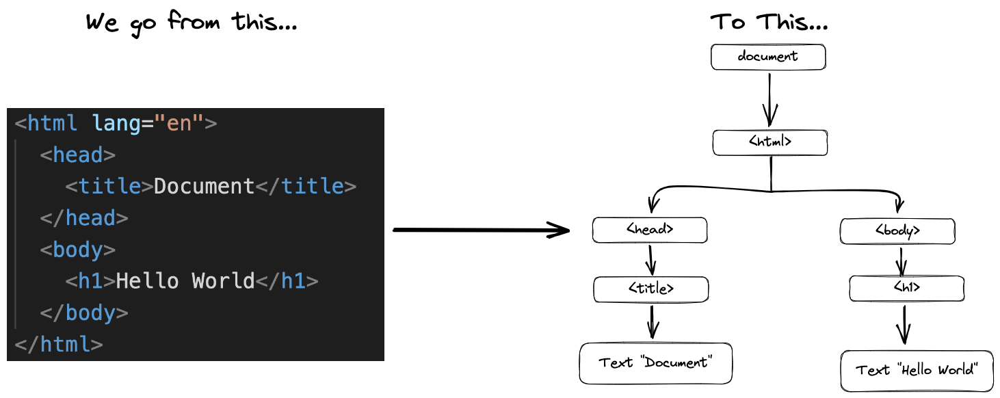
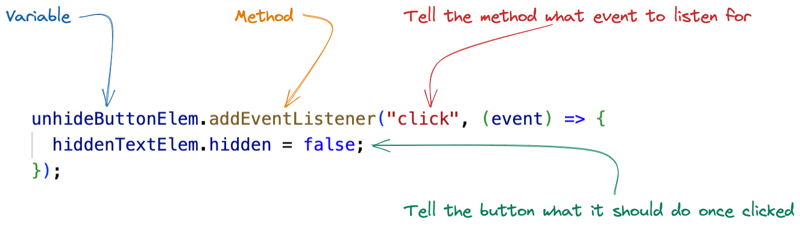

# Software Development Bootcamp

## Unit 2: JavaScript Foundations

### Lesson 5: The DOM and Events

### Gurneesh Singh

---

# Agenda

<div style="font-size: 20px;">

- Recap of Previous Lesson
- Section 1: The DOM
  - What is the DOM?
  - Why is it important?
- Section 2: CRUD Operations on the DOM
  - Create, Read, Update, Delete elements
- Section 3: Events
  - What are Events?
  - Handling Events (e.g., clicks)
- Section 4: DOM and CSS
  - Manipulating Styles and Classes
- Section 5: Assignment - Rock, Paper, Scissors
- Next Lesson Preview

</div>

---

# Learning Objectives

By the end of this class, you will be able to:

*   Discuss the DOM and its importance for the interactivity of websites
*   Use JavaScript to create interactive HTML/CSS documents
*   Perform CRUD operations on DOM elements
*   Handle basic user events like button clicks
*   Manipulate CSS styles and classes using JavaScript

---

# Recap 

## From Lesson 4: Scope & OOP

<div style="font-size: 20px;">

- **Scope**: Global, Function, Block (using `let`, `const`)
- **Objects**: Key-value pairs, properties, methods
- **OOP**: Classes (`constructor`, methods), instances (`new`)

*Key takeaway: Objects help structure data, Scope controls variable access.*


</div>

---

# Section 1: The DOM 

## What is the Document Object Model (DOM)?

<div style="font-size: 20px;">

- It's a programming interface for HTML documents.
- Represents the page structure as a **tree of objects**.
- Each HTML element, attribute, and text node becomes an object in the tree.
- Allows programs (like JavaScript) to **dynamically access and update** the content, structure, and style of a document.

**Think of it like a live, editable blueprint of your webpage.**

</div>

---

## The DOM Tree Structure

<div style="font-size: 18px; display: flex; align-items: center; gap: 20px; justify-content: space-around">



</div>

<div style="font-size: 18px;">

- `document` is the root object.
- Elements like `<html>`, `<head>`, `<body>`, `<h1>`, `<p>` are nodes (objects).
- Text inside elements ("My Page", "Welcome!", "This is a paragraph.") are also nodes.

*JavaScript uses this tree to find and manipulate parts of the page.*

</div>

---

# Section 2: CRUD Operations 

## Creating, Reading, Updating, Deleting DOM Elements

<div style="font-size: 20px;">

CRUD stands for:
- **C**reate: Add new elements to the page.
- **R**ead: Find and access existing elements.
- **U**pdate: Change the content or attributes of elements.
- **D**elete: Remove elements from the page.

*These are the fundamental ways JavaScript interacts with the HTML structure.*

</div>

---

## Reading Elements (Finding Nodes)

<div style="font-size: 18px;">

Common methods to select elements:

```javascript
// Get element by its unique ID
let mainHeading = document.getElementById('main-title');

// Get elements by tag name (returns HTMLCollection)
let allParagraphs = document.getElementsByTagName('p');

// Get elements by class name (returns HTMLCollection)
let buttons = document.getElementsByClassName('btn');

// Get the FIRST element matching a CSS selector
let firstButton = document.querySelector('.btn');

// Get ALL elements matching a CSS selector (returns NodeList)
let allButtons = document.querySelectorAll('.btn');
```

*`getElementById` and `querySelector` are often the most useful for specific elements.*

</div>

---

## Updating Elements

<div style="font-size: 18px;">

Once you have selected an element, you can change it:

```javascript
// Get the element
let mainHeading = document.getElementById('main-title');

// Change its text content
mainHeading.textContent = 'New Welcome Message!';

// Change its inner HTML
let contentDiv = document.getElementById('content');
contentDiv.innerHTML = '<p>This paragraph was <strong>added</strong> by JS!</p>';

// Change an attribute
let logo = document.getElementById('logo-img');
logo.setAttribute('src', 'new_logo.png');
```

*You can change text, HTML structure, attributes, and styles.*

</div>

---

## Creating Elements

<div style="font-size: 18px;">

Create new elements and add them to the DOM:

```javascript
// 1. Create the new element
let newParagraph = document.createElement('p');

// 2. Set its content or attributes
newParagraph.textContent = 'This is a brand new paragraph!';
newParagraph.id = 'new-para';
newParagraph.classList.add('highlight'); // Add a CSS class

// 3. Find the parent element where you want to add it
let contentDiv = document.getElementById('content');

// 4. Append the new element to the parent
contentDiv.appendChild(newParagraph);
```

*Create -> Configure -> Find Parent -> Append*

</div>

---

## Deleting Elements

<div style="font-size: 18px;">

Remove elements from the DOM:

```javascript
// 1. Find the element to remove
let paragraphToRemove = document.getElementById('old-para');

// 2. Call the remove() method on the element
if (paragraphToRemove) { // Check if it exists first
  paragraphToRemove.remove();
}

// Alternative (older way): Find the parent first
let parent = paragraphToRemove.parentNode;
if (parent && paragraphToRemove) {
  parent.removeChild(paragraphToRemove);
}
```

*`.remove()` is the modern and simpler way.*

</div>

---

# 10-minute Break

---

# Section 3: Events 

## What are Events?

<div style="font-size: 20px;">

Events are **actions or occurrences** that happen in the browser, such as:
- User interactions (clicking a button, typing in a field, moving the mouse)
- Browser actions (page finishing loading, window resizing)
- Server responses (data arriving from an API)

JavaScript can **listen** for these events and **react** by executing code.

*Events make web pages interactive.*

</div>

---



---

## Event Handling: Listening for Events

<div style="font-size: 18px;">

The modern way to handle events is using `addEventListener`:

```javascript
// 1. Select the element that will trigger the event
let myButton = document.getElementById('click-me-button');

// 2. Define the function to run when the event occurs (event handler)
function handleClick() {
  alert('Button was clicked!');
  console.log('Click event detected.');
}

// 3. Attach the event listener
// Args: event type (string), handler function, [options]
myButton.addEventListener('click', handleClick);

// You can also use anonymous functions or arrow functions directly:
myButton.addEventListener('mouseover', () => {
  console.log('Mouse is over the button!');
});
```

*Select Element -> Define Handler -> Add Listener*

</div>

---

## Common Event Types

<div style="font-size: 18px;">

- **Mouse Events**: `click`, `dblclick`, `mousedown`, `mouseup`, `mouseover`, `mouseout`, `mousemove`
- **Keyboard Events**: `keydown`, `keyup`, `keypress`
- **Form Events**: `submit`, `change` (for `<input>`, `<select>`, `<textarea>`), `focus`, `blur`
- **Window Events**: `load` (page finished loading), `resize`, `scroll`
- **Touch Events**: `touchstart`, `touchmove`, `touchend`

*Choose the event type that matches the interaction you want to capture.*

</div>

---

## The Event Object

<div style="font-size: 18px;">

When an event occurs, the browser passes an **event object** to the handler function. This object contains useful information about the event:

```javascript
let myButton = document.getElementById('info-button');

function showEventInfo(event) {
  console.log('Event Type:', event.type); // e.g., "click"
  console.log('Target Element:', event.target); // The element that triggered the event (the button)
  console.log('Timestamp:', event.timeStamp); // When the event happened

  // For mouse events:
  if (event.type.startsWith('mouse')) {
    console.log('Mouse X:', event.clientX);
    console.log('Mouse Y:', event.clientY);
  }
  
  // Prevent default behavior (e.g., form submission)
  // event.preventDefault(); 
}

myButton.addEventListener('click', showEventInfo);
```

*The event object provides context about what happened.*

</div>

---

# Section 4: DOM and CSS 

## Manipulating Styles with JavaScript

<div style="font-size: 18px;">

You can directly change the inline styles of an element using the `style` property:

```javascript
// 1. Select the element
let box = document.getElementById('my-box');

// 2. Access the style property and set CSS properties
// Note: CSS properties with hyphens (e.g., background-color) become camelCase (backgroundColor)
box.style.backgroundColor = 'lightblue';
box.style.width = '200px';
box.style.height = '100px';
box.style.border = '2px solid navy';
box.style.padding = '10px';

// Reading styles (generally only gets inline styles)
console.log(box.style.backgroundColor); // "lightblue"
```

*Useful for dynamic styling based on conditions, but can clutter HTML.*

</div>

---

## Manipulating CSS Classes

<div style="font-size: 16px;">

A cleaner way to change appearance is by adding/removing CSS classes (defined in your CSS file):

```css
/* In your style.css */
.highlight {
  background-color: yellow;
  font-weight: bold;
  border: 1px solid red;
}

.hidden {
  display: none;
}
```

```javascript
// Select the element
let message = document.getElementById('status-message');

// Add a class
message.classList.add('highlight');

// Remove a class
message.classList.remove('hidden');

// Toggle a class (add if not present, remove if present)
message.classList.toggle('active');

// Check if a class exists
if (message.classList.contains('highlight')) {
  console.log('Message is highlighted!');
}
```

</div>

---

# Section 5: Assignment 

## Assignment: Rock, Paper, Scissors Game

<div style="font-size: 17px;">

**Goal:** Create a simple web page where the user can play Rock, Paper, Scissors against the computer.

**Requirements:**
1.  **HTML Structure:**
    *   Buttons for the user to choose Rock, Paper, or Scissors.
    *   Areas to display the user's choice, the computer's choice, and the result (Win/Lose/Tie).

 ---
    
2.  **JavaScript Logic:**
    *   Add event listeners to the buttons.
    *   When a button is clicked:
        *   Determine the user's choice.
        *   Generate a random choice for the computer (Rock, Paper, or Scissors).
        *   Compare the choices to determine the winner.
        *   Update the DOM to display the choices and the result.

*Focus on using DOM manipulation and event handling skills learned today.*
*Hints: Use `Math.random()`, `if/else` statements, `textContent`.*

</div>

