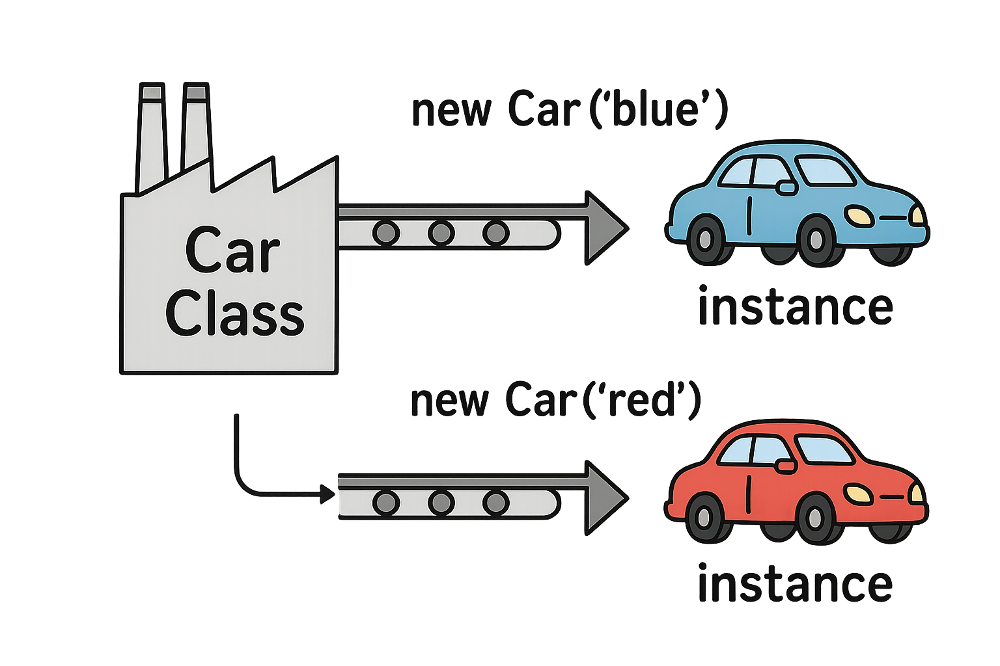

# Software Development Bootcamp

## Unit 2: JavaScript Foundations

### Lesson 4: Scope and Object-Oriented Programming

### Gurneesh Singh

---

# Agenda

<div style="font-size: 20px;">

- Recap of Previous Lesson
- Scope in JavaScript
  - Global, Function, and Block Scope
  - Variable Lifetime
- Objects in JavaScript
  - What is an Object?
  - Creating and Using Objects
- Object-Oriented Programming (OOP)
  - Introduction to OOP Concepts
  - Practical Applications
- Use Cases for OOP
- Next Lesson Preview

</div>

---

# Learning Objectives

By the end of this class, you will be able to:
* Determine scope in JavaScript
* Differentiate between global and local scope
* Understand what objects are and how to use them
* Recognize the principles of Object-Oriented Programming

---

# Section 1: Recap

## From Previous Lessons

<div style="display: grid; grid-template-columns: 1fr 1fr; font-size: 20px;">

<div>

### Variables and Data Types
- Primitive types: String, Number, Boolean
- Complex types: Array
- Variable declarations: `let`, `const`

### Functions
- Function declarations and expressions
- Parameters and return values
- Arrow functions

</div>

<div>

### Control Flow
- Conditional statements: if/else, switch
- Comparison and logical operators

### Loops
- for loops
- while and do...while loops
- Array iteration methods
- Loop control: break and continue

</div>

</div>

Any topics you would like to review?

---

# Section 2: Scope in JavaScript

## What is Scope?

<div style="font-size: 20px;">

Scope determines the visibility and accessibility of variables, functions, and objects in your code.

**Why is scope important?**
- Prevents variable name conflicts
- Controls variable lifetime
- Establishes clear boundaries between code sections

*Understanding scope helps you avoid bugs and write cleaner code*

</div>

---

# Types of Scope in JavaScript

<div style="font-size: 20px;">

JavaScript has three main types of scope:

1. **Global Scope**
   - Variables declared outside any function or block
   - Accessible from anywhere in the code

2. **Function Scope**
   - Variables declared inside a function
   - Only accessible within that function

3. **Block Scope** (introduced with ES6)
   - Variables declared inside a block `{}`
   - Only accessible within that block (when using `let` or `const`)


</div>

---

# Global Scope

<div style="display: grid; grid-template-columns: 1fr 1fr; font-size: 20px; gap: 20px;">

<div>

Variables declared outside any function or block are in the global scope:

```javascript
// Global variables
let appName = "My Application";
const version = "1.0.0";

function displayInfo() {
  // Can access global variables
  console.log(`${appName} v${version}`);
}

displayInfo(); // "My Application v1.0.0"
```

</div>

<div>

### Characteristics of Global Scope:
- Accessible from anywhere
- Exists throughout program execution
- Shared across all code
- Can be modified from anywhere

### Potential Issues:
- Name conflicts
- Unintended modifications
- Memory usage
- Harder to track changes

*Minimize global variables for cleaner code*

</div>

</div>

---

# Function Scope

<div style="display: grid; grid-template-columns: 1fr 1fr; font-size: 20px; gap: 20px;">

<div>

Variables declared inside a function are only accessible within that function:

```javascript
function calculateTotal(price, tax) {
  // Function-scoped variables
  let taxAmount = price * tax;
  let total = price + taxAmount;
  
  return total;
}

let result = calculateTotal(100, 0.07);
console.log(result); // 107

// Error: taxAmount is not defined
console.log(taxAmount);
```

</div>

<div>

### Characteristics:
- Only accessible inside the function
- Created when function is called
- Removed when function completes
- Unique to each function call

*Function scope creates isolation and prevents variable name conflicts*

</div>

</div>

---

# Block Scope

<div style="display: grid; grid-template-columns: 1fr 1fr; font-size: 20px; gap: 20px;">

<div>

Variables declared with `let` or `const` inside a block `{}` are block-scoped:

```javascript
if (true) {
  // Block-scoped variables
  let blockVariable = "I'm in a block";
  const fixedValue = 42;
  
  console.log(blockVariable); // Works
}

// Error: blockVariable is not defined
console.log(blockVariable);

// var behaves differently (function-scoped)
if (true) {
  var oldWay = "I escape blocks";
}
console.log(oldWay); // Works!
```

</div>

<div>

### Block Scope vs. var:
- `let` and `const` respect block boundaries
- `var` is function-scoped, not block-scoped
- Blocks include: if statements, for loops, while loops

*Block scope provides more precise control of variable lifetime*

</div>

</div>

---


# Variable Lifetime

<div style="font-size: 20px;">

The lifetime of a variable depends on its scope:

- **Global variables**: 
  - Created when the script loads
  - Exist until the page is closed/refreshed

- **Function variables**:
  - Created when the function is called
  - Exist until the function completes execution

- **Block variables**:
  - Created when the block is entered
  - Exist until the block is exited

*Understanding variable lifetime helps manage memory usage effectively*

</div>

---

# Activity: Scope Exercise (10 minutes)

<div style="font-size: 20px;">

Identify the scope of each variable and predict the output:

```javascript
let globalVar = "I'm global";

function scopeExercise() {
  let functionVar = "I'm function-scoped";
  
  if (true) {
    let blockVar = "I'm block-scoped";
    var leakyVar = "I leak outside the block";
    
    console.log(globalVar);    // Output 1
    console.log(functionVar);  // Output 2
    console.log(blockVar);     // Output 3
  }
  
  console.log(globalVar);      // Output 4
  console.log(functionVar);    // Output 5
  console.log(leakyVar);       // Output 6
  console.log(blockVar);       // Output 7
}

scopeExercise();
```

*Discuss the errors and understand why they occur*

</div>

---

# Section 3: Objects in JavaScript

## What is an Object?

<div style="display: grid; grid-template-columns: 1fr 1fr; font-size: 20px; gap: 20px;">

<div>

In JavaScript, an object is:
- A collection of related data and/or functionality
- Stored as key-value pairs (properties)
- One of the most important data structures

In real life, objects have:
- Properties (characteristics)
- Methods (actions they can perform)

</div>

<div>

### Real-world examples:

**A Car:**
- Properties: color, make, model, year
- Methods: start, stop, accelerate, turn

**A Person:**
- Properties: name, age, height, eye color
- Methods: walk, talk, eat, sleep

*JavaScript objects mirror real-world objects*

</div>

</div>

---

# Array to Object Comparison

<div style="display: grid; grid-template-columns: 1fr 1fr; font-size: 20px; gap: 20px; justify-items: center">

<div style="display: flex; gap: 20px">


</div>

<div>

- Arrays are ordered lists of values, like a filing cabinet, accessed by index
- Objects are unordered collections of key-value pairs, accessed by their keys

```javascript
let filingCabinet = [1, 2, 3];
const filingCabinetFirstItem = filingCabinet[0];

let kitchenShelf = { 
  topShelf: "flour, cup, plates",  
  middleShelf: "bottles, bowl",
  bottomShelf: "pot"
};
const pot = kitchenShelf.bottomShelf;

```

</div>

</div>

---

# Creating Objects in JavaScript

<div style="font-size: 20px;">

### Object Literal Syntax

```javascript
// Creating an object literal
let car = {
  // Properties
  make: "Toyota",
  model: "Corolla",
  year: 2023,
  color: "blue",
  
  // Methods
  start: function() {
    return "Engine started!";
  },
  drive: function() {
    return "The car is moving!";
  }
};
```

*Object literals are the simplest way to create objects*

</div>

---

# Accessing Object Properties and Methods

<div style="display: grid; grid-template-columns: 1fr 1fr; font-size: 20px; gap: 20px;">

<div>

You can access object properties and methods in two ways:

### Dot Notation (Most common)
```javascript
let car = {
  make: "Toyota",
  model: "Corolla"
};

// Accessing properties
console.log(car.make);  // "Toyota"
console.log(car.model); // "Corolla"

// Calling methods
let dog = {
  bark: function() { 
    return "Woof!"; 
  }
};
console.log(dog.bark()); // "Woof!"
```

</div>

<div>

### Bracket Notation (Dynamic access)
```javascript
let car = {
  make: "Toyota",
  model: "Corolla"
};

// Accessing properties
console.log(car["make"]);  // "Toyota"

// Useful for dynamic property names
let propertyName = "model";
console.log(car[propertyName]); // "Corolla"

// Or when property names have spaces
let person = {
  "first name": "John",
  "last name": "Doe"
};
console.log(person["first name"]); // "John"
```

</div>

</div>

---

# Modifying Objects

<div style="font-size: 20px;">

Objects in JavaScript are mutable - their properties can be changed:

```javascript
let person = {
  name: "Alice",
  age: 25
};

// Changing existing properties
person.age = 26;
person["name"] = "Alice Smith";

// Adding new properties
person.email = "alice@example.com";
person["isEmployed"] = true;

// Removing properties
delete person.age;

console.log(person);
// Output: { name: "Alice Smith", email: "alice@example.com", isEmployed: true }
```

*Objects can be modified at any time after creation*

</div>

---

# Traversing Object Properties

<div style="font-size: 20px;">

You can loop through all properties of an object:

```javascript
let car = {
  make: "Toyota",
  model: "Corolla",
  year: 2023,
  color: "blue"
};

// Using for...in loop
for (let property in car) {
  console.log(`${property}: ${car[property]}`);
}
// Output:
// make: Toyota
// model: Corolla
// year: 2023
// color: blue
```

</div>

---

# Objects within Objects (Nested Objects)

<div style="font-size: 20px;">

Objects can contain other objects as property values:

```javascript
let person = {
  name: "John",
  age: 30,
  // Address is a nested object
  address: {
    street: "123 Main St",
    city: "Boston",
    state: "MA",
    zipCode: "02101"
  },
  // Hobbies is an array
  hobbies: ["reading", "cycling", "photography"]
};

// Accessing nested properties
console.log(person.address.city); // "Boston"
console.log(person.hobbies[1]); // "cycling"

// Modifying nested properties
person.address.street = "456 Oak Ave";
person.hobbies.push("cooking");
```

*Complex data can be organized in nested structures*

</div>

---

# Section 4: Object-Oriented Programming (OOP)

## What is OOP?

<div style="font-size: 20px;">

Object-Oriented Programming is a programming paradigm based on:

- Creating objects that contain data and methods
- Organizing code into objects that interact with each other
- Modeling software based on real-world objects and their interactions

**The Four Pillars of OOP:**
1. **Encapsulation**: Bundling data and methods that work on that data
2. **Abstraction**: Hiding complex implementation details
3. **Inheritance**: Creating new classes based on existing ones
4. **Polymorphism**: Using a single interface to represent different types

*OOP helps organize and structure code in a way that mirrors the real world*

</div>

---

# ES6 Classes

<div style="font-size: 18px;">

```javascript
// Class declaration
class Car {
  constructor(model, color) {
    this.model = model;
    this.color = color;
    this.isRunning = false;
  }
  
  // Method
  start() {
    this.isRunning = true;
    return `The ${this.color} ${this.model} engine has started`;
  }
  
  // Another method
  honk() {
    return `The ${this.color} ${this.model} goes beep beep!`;
  }
}

// Creating objects (instances) from the class
let blueCar = new Car("Toyota Corolla", "blue");
let redCar = new Car("Honda Civic", "red");
console.log(blueCar.start()); // "The blue Toyota Corolla engine has started"
console.log(redCar.honk()); // "The red Honda Civic goes beep beep!"
```

*Classes provide a more familiar syntax for developers coming from other languages*

</div>

---

# Class as a "Factory", Objects as "Instances"

<div style="background-color: white; display: flex; justify-content: center">



</div>


---

# Object Comparison

<div style="font-size: 20px;">

Comparing objects in JavaScript works differently than comparing primitive values:

```javascript
// Primitive comparison (compares values)
let a = 5;
let b = 5;
console.log(a === b); // true

// Object comparison (compares references)
let obj1 = { name: "John" };
let obj2 = { name: "John" };
let obj3 = obj1;

console.log(obj1 === obj2); // false (different objects in memory)
console.log(obj1 === obj3); // true (same reference)

// Comparing object properties
function areEqual(object1, object2) {
  return object1.name === object2.name;
}
console.log(areEqual(obj1, obj2)); // true (same property values)
```

*Objects are compared by reference, not by their content*

</div>

---

# Section 5: Use Cases for OOP

<div style="font-size: 20px;">

### When to use Object-Oriented Programming:

1. **Modeling Real-World Entities**
   - Users, products, vehicles, orders

2. **Managing Complex State**
   - Game objects, UI components, form data

3. **Code Organization**
   - Grouping related functionality
   - Creating reusable components

*OOP shines when managing complexity and creating well-organized systems*

</div>

---

# Practical Example: Shopping Cart System

<div style="font-size: 12px;">

```javascript
// Product class
class Product {
  constructor(id, name, price) {
    this.id = id;
    this.name = name;
    this.price = price;
  }
}

// Shopping Cart class
class ShoppingCart {
  constructor() {
    this.items = [];
  }
  
  addItem(product, quantity = 1) {
    this.items.push({ product, quantity });
    return `Added ${quantity} ${product.name}(s) to cart`;
  }
  
  getTotal() {
    let total = 0;
    for (let item of this.items) {
      total += item.product.price * item.quantity;
    }
    return total;
  }
  
  getItemCount() {
    let count = 0;
    for (let item of this.items) {
      count += item.quantity;
    }
    return count;
  }
}

// Usage
const laptop = new Product(1, "Laptop", 999.99);
const phone = new Product(2, "Smartphone", 699.99);

const cart = new ShoppingCart();
cart.addItem(laptop);
cart.addItem(phone, 2);

console.log(`Total items: ${cart.getItemCount()}`); // "Total items: 3"
console.log(`Total price: $${cart.getTotal().toFixed(2)}`); // "Total price: $2399.97"
```

</div>

---


# Key Takeaways

- Scope determines where variables are accessible in your code
- Global, function, and block scope each have different behaviors and use cases
- Objects allow organizing related data and functionality together
- Object-Oriented Programming provides structure for complex applications
- OOP principles help write more maintainable and scalable code
- Understanding scope and objects will help you work with the DOM

---

# Thank You!

