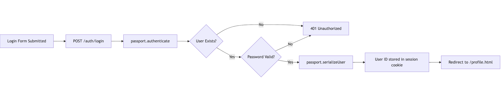
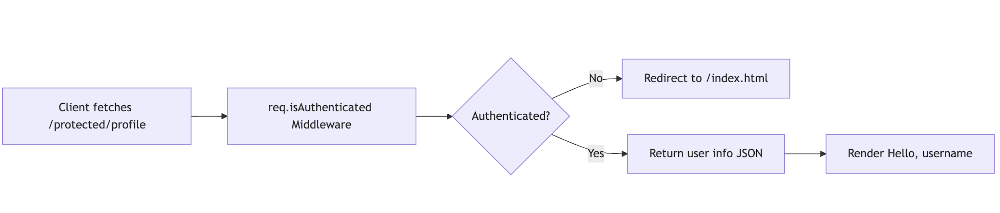

# Software Development Bootcamp  
## Unit 3 · Backend Development  
### Lesson 1 ·Passport-Authentication (Passport.js)  
### Gurneesh Singh

---

# Agenda  
- Recap: Authentication Basics  
- Section 1: Passport Overview  
- Section 2: Session Setup with `express-session`  
- Section 3: Passport Local Strategy  
- Section 4: Routes and Protected Pages  

---

# Learning Objectives  
By the end of this lesson, learners can:  
1. Configure `express-session` securely  
2. Use `passport-local` strategy for authentication  
3. Hash and validate passwords with `bcrypt`  
4. Implement login, logout, and protected routes  
5. Understand session serialization/deserialization

---

# Key Concepts  
- Sessions vs JWTs  
- What Passport.js handles  
- Middleware order in Express  
- Hashing vs encryption  
- `req.user`, `req.isAuthenticated()`  
- Role of `passport-config.js`


---

# Setup: Install Packages  
```bash
npm install express mongoose passport passport-local express-session bcrypt dotenv morgan
```

---

# Step 1: Define the User Model  
```js
const userSchema = new mongoose.Schema({
  username: { type: String, required: true, unique: true },
  password: { type: String, required: true },
});
```

Add methods for hashing and validating:
```js
userSchema.statics.hashPassword = async function (pw) {
  return await bcrypt.hash(pw, 10);
};
userSchema.methods.isValidPassword = async function (pw) {
  return await bcrypt.compare(pw, this.password);
};
```

---

# Step 2: Configure Passport  
```js
passport.use(new LocalStrategy(
  async (username, password, done) => {
    const user = await User.findOne({ username });
    if (!user || !(await user.isValidPassword(password))) {
      return done(null, false, { message: "Invalid credentials" });
    }
    return done(null, user);
  }
));
```

Serialize/deserialize user by ID:
```js
passport.serializeUser((user, done) => done(null, user.id));
passport.deserializeUser(async (id, done) => {
  const user = await User.findById(id);
  done(null, { username: user.username });
});
```

---

# Step 3: Configure Express App  
```js
app.use(session({
  secret: process.env.SESSION_SECRET || "your_secret_key",
  resave: false,
  saveUninitialized: false,
  cookie: {
    secure: process.env.NODE_ENV === "production",
    sameSite: "strict",
    maxAge: 1000 * 60 * 60 * 24 * 7,
  },
}));

app.use(passport.initialize());
app.use(passport.session());
```

---

# Step 4: Auth Routes  
Register:
```js
const hashed = await User.hashPassword(password);
await new User({ username, password: hashed }).save();
```

Login:
```js
router.post("/login", passport.authenticate("local"), (req, res) => {
  res.json({ message: "Login successful", user: req.user });
});
```

Logout:
```js
req.logout(err => { if (err) return res.status(500).json({ error: err }); res.redirect("/index.html"); });
```

---

# Step 5: Protect Routes  
Middleware:
```js
function ensureAuthenticated(req, res, next) {
  if (req.isAuthenticated()) return next();
  res.status(401).json({ message: "Unauthorized" });
}
```

Usage:
```js
router.get("/profile", ensureAuthenticated, (req, res) => {
  res.json({ username: req.user.username });
});
```

---

# Frontend Pages  
- `index.html` → login and register forms  
- `profile.html` → fetches `/protected/profile`  
- `secure.html` → fetches `/protected/secure`  
- JS uses `fetch()` and redirects on auth failure

---

# Diagram 




---

# Summary  
✅ LocalStrategy with hashed passwords  
✅ Sessions stored in cookie  
✅ Middleware protects routes  
✅ Logout clears session  
✅ Frontend integrated with fetch()


